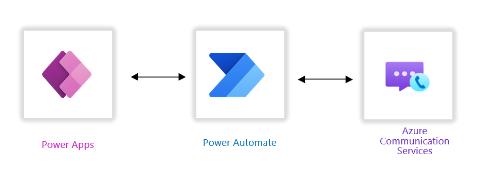

<!-- markdownlint-disable MD041 -->

**Level**: Intermediate

In this tutorial, you’ll learn how to use Azure Communication Services with Power Platform to enable seamless communication in your applications. Azure Communication Services enables you to add communication features like voice and video calling, SMS, email functionalities, and rich text chat to your applications, without requiring an in-depth understanding of underlying technologies. You can use REST APIs and client library SDKs to seamlessly integrate communication features into your applications.

In this tutorial, you’ll also see how to use Power Apps and Power Automate for low-code and no-code development, which will help you save time and effort. You’ll discover how to unlock the true potential of seamless communication and enhance your application’s capabilities with Azure Communication Services.

### Overview of the Application Solution

### Prerequisites

- [Azure subscription](https://azure.microsoft.com/free/search)
- [Microsoft 365 developer tenant](https://developer.microsoft.com/microsoft-365/dev-program)

### Technologies used in this tutorial include

- Power Apps
- Azure Communication Services
- Power Automate